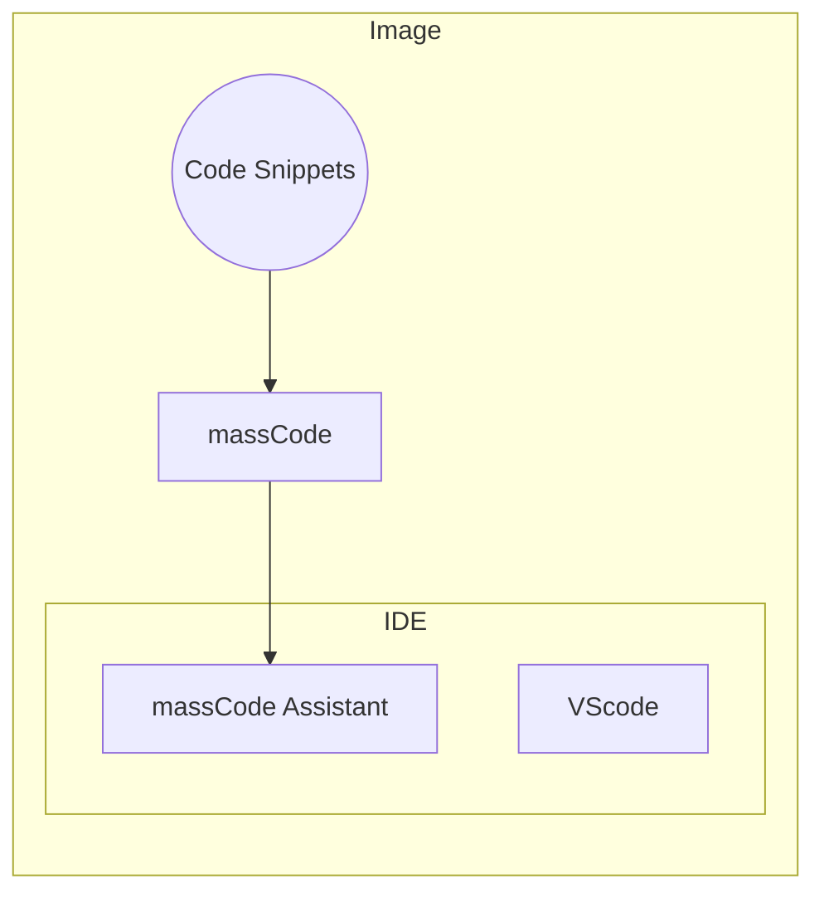

# Code-server-massCode

This project is a dockerfile source for the image that intergates vscode server, [massCode](https://masscode.io/) and its extension for vscode([massCode Assistant](https://marketplace.visualstudio.com/items?itemName=AntonReshetov.masscode-assistant)). Taking the advantage of massCode, the image can be deployed as a web IDE that can use customed code snippets.



It is useful when you are a code snippet provider and you want to let your users code with web IDE. Or you get used to code in self-hosted web IDE on your cloud server and want to use managed code snippets.

## Usage

As the image built with the [Dockerfile](./Dockerfile) doesn't contain any code, you should take the image as base image and prepare 
code snippets with massCode in your building machine. Copy the massCode folder (the folder is `/home/{your_name}/massCode` by default) to this project directory and your dockerfile may looks like:

```dockerfile
FROM dxsooo/code-server-masscode:1.0

COPY massCode /root/massCode
```

Or just add the COPY command into the [Dockerfile](./Dockerfile) and build your own image. You should do more such as adding more extensions to make the IDE better for development.

Deploy with:

```bash
# replace the image with your own and mount your code path
docker run --name code-server -p8080:8080 -v{your_code_path}:/home/coder/projects -d dxsooo/code-server-masscode:1.0
```

And the web IDE would serve in: http://localhost:8080 . See https://github.com/cdr/code-server for more docs.

## Thoughts

Maybe there is another way to do this, such as following [snippet guide](https://code.visualstudio.com/api/language-extensions/snippet-guide) from vscode, pack the snippets to an extension and release it or pack it into web IDE image. But this would take cost to edit snippet jsons or migrate from massCode(or some other snippet management tools) to align to vscode snippets rules.