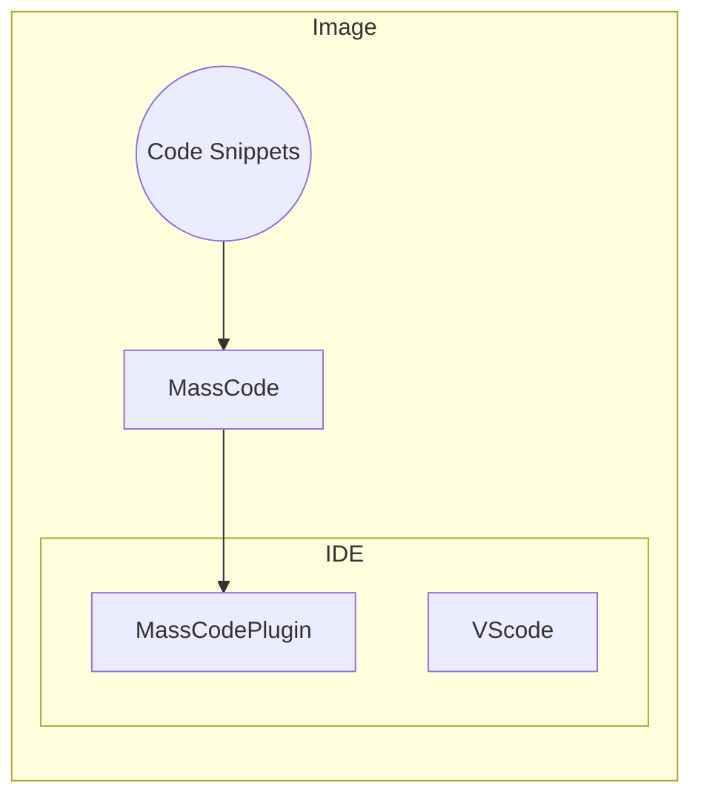

# Code-server-massCode

This project is mainly a dockerfile source for an image that intergates open vscode server, [massCode](https://masscode.io/) and its plugin for vscode. Taking the advantage of masscode, the image can be deployed as a Web IDE that can use customed code snippets.

